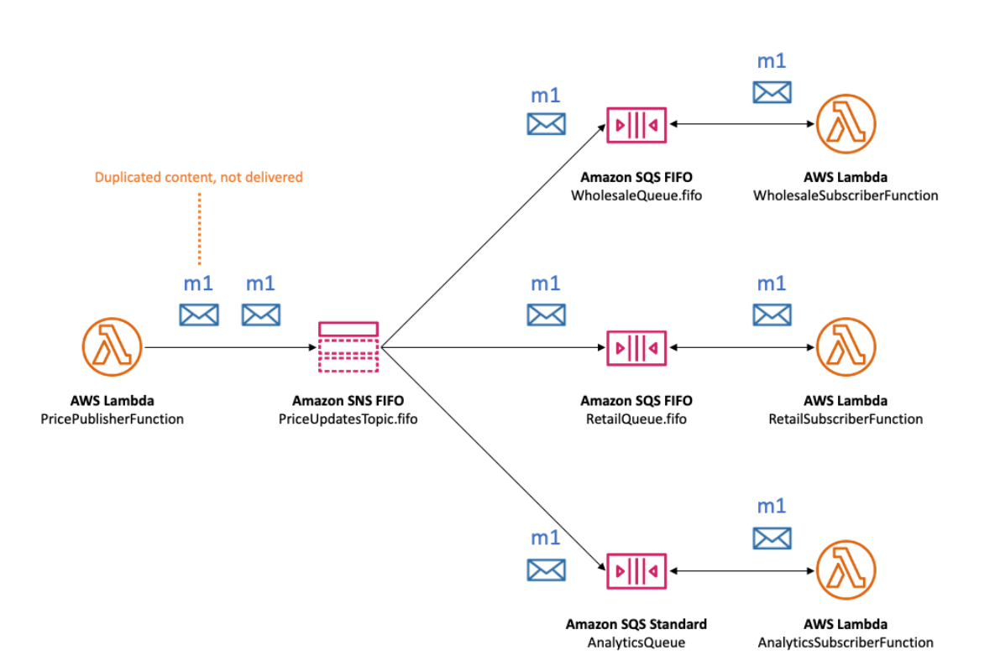

# Decoupling Applications – Event-Driven Architecture on AWS

This repository documents the full implementation of the “Decoupling Applications” lab from AWS Cloud Quest.  
The solution demonstrates how to improve availability, fault tolerance, and scalability by decoupling microservices using Amazon SNS and Amazon SQS.

---

## Overview

Modern applications benefit from asynchronous communication and loose coupling between components.  
This implementation uses an Amazon SNS topic to fan out events to multiple subscribers, including two SQS queues, HTTP endpoints, AWS Lambda functions, and Amazon Kinesis Data Firehose.

The workflow eliminates point-to-point dependencies and prevents cascading failures.

---

## Architecture

**Producer → SNS Topic → Multiple Subscribers**

Subscribers:
- SQS Queue #1 → Consumer #1  
- SQS Queue #2 → Consumer #2  
- HTTP Endpoint  
- AWS Lambda  
- Kinesis Data Firehose  

SNS distributes the message to all subscribers, enabling independent scaling and processing.

Architecture diagrams are available in the [`architecture/`](./architecture) folder:

- **Decoupled Architecture (SNS Fan-Out)**  
  

- **Dead-Letter Queue (DLQ) Redrive Flow**  
  

